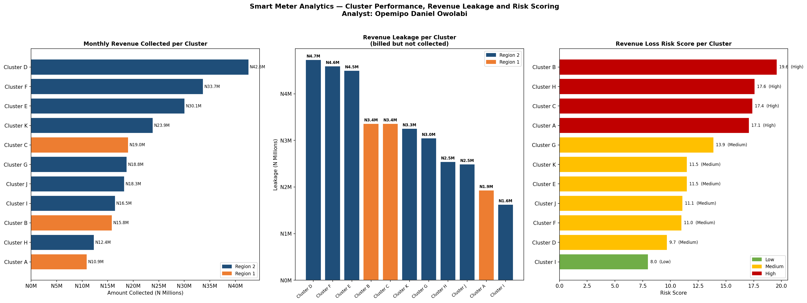
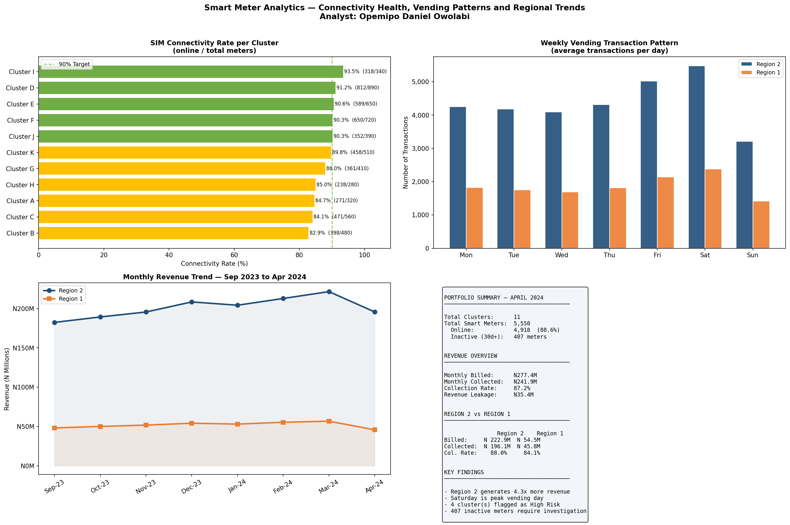

# Smart Meter Analytics — Energy Vending and Revenue Intelligence

**Portfolio Project 5** — IoT data analytics for smart meter infrastructure covering 11 clusters across two regions, analysing vending performance, revenue leakage, meter connectivity and customer engagement.

> Built by **Opemipo Daniel Owolabi** — Data Analyst | Python · SQL · Power BI · Tableau  
> Faro, Portugal | opemipoowolabi001@gmail.com

---

## Note on Data

All company names, client names, cluster locations and identifying information have been anonymised in this public version to protect client confidentiality. Clusters are referred to as Cluster A through Cluster K. Regions are referred to as Region 1 and Region 2. The analytical approach, methodology and findings reflect real work conducted during professional employment in the smart meter infrastructure sector.

---

## Business Problem

A smart meter infrastructure company installed and managed prepaid smart meters connected via SIM card (GSM/GPRS) across multiple clusters in two regions. Management needed visibility into:

1. Which clusters generate the most revenue and which are underperforming
2. Where the gap between billing and collection exists
3. Which meters have gone inactive for 30 or more days
4. What the weekly vending pattern looks like across clusters
5. How the two regions compare in revenue performance
6. Which clusters have the weakest SIM connectivity

---

## Dashboard Preview




---

## Key Results — April 2024

| Metric | Value |
|--------|-------|
| Total Smart Meters | 5,550 |
| Online Meters | 4,918 (88.6%) |
| Inactive Meters (30d+) | 407 |
| Monthly Billed | N277.4 Million |
| Monthly Collected | N241.9 Million |
| Collection Rate | 87.2% |
| Revenue Leakage | N35.4 Million |
| Region 2 Share of Revenue | 81.1% |
| Region 1 Share of Revenue | 18.9% |

---

## Six Analyses

### 1 — Cluster Revenue Performance
All 11 clusters ranked by monthly revenue collected. Region 2 clusters dominate the top positions.

### 2 — Revenue Leakage Detection
Billed vs collected gap per cluster. Total monthly leakage of N35.4M identified across the portfolio.

### 3 — Revenue Loss Risk Score
Each cluster scored using collection rate (40% weight), SIM connectivity rate (30% weight), and inactive meter rate (30% weight).

### 4 — SIM Connectivity Health
Percentage of meters online per cluster. Target is 90%. Clusters below 85% flagged for SIM maintenance.

### 5 — Weekly Vending Pattern
Saturday is consistently the peak vending day across all clusters in both regions — likely aligned with end-of-week salary payments.

### 6 — Monthly Revenue Trend
8-month trend showing Region 2 generating significantly more revenue than Region 1 consistently across the period.

---

## Project Structure

```
project5/
├── smart_meter_analytics.py          # Main analysis script
├── smart_meter_dashboard_page1.png   # Cluster performance, leakage, risk
├── smart_meter_dashboard_page2.png   # Connectivity, vending pattern, trends
└── README.md                         # This file
```

---

## How to Run

```bash
git clone https://github.com/opemipo-analytics/smart-meter-analytics.git
cd smart-meter-analytics

pip install pandas numpy matplotlib seaborn

python smart_meter_analytics.py
```

---

## Tools and Technologies

| Tool | Purpose |
|------|---------|
| Python 3 | Core scripting and pipeline |
| Pandas | Data aggregation and transformation |
| Matplotlib | Multi-panel dashboard visualisations |
| NumPy | Numerical calculations |

---

## Skills Demonstrated

- IoT data analytics — processing smart meter transaction and connectivity data
- Revenue intelligence — leakage detection, inactive meter identification, risk scoring
- Composite risk scoring — multi-factor weighted scoring model
- Regional comparison — benchmarking performance across two regions
- Operational analytics — translating meter data into field action recommendations

---

## Other Projects

| Project | Description |
|---------|-------------|
| [Marketer Performance Analysis](https://github.com/opemipo-analytics/AEDC-MARKETERS-ANALYTICS) | Python analysis of field marketer KPIs |
| [Revenue Forecasting ML](https://github.com/opemipo-analytics/aedc-revenue-forecasting) | Machine learning revenue forecast |
| [Customer Segmentation](https://github.com/opemipo-analytics/aedc-customer-segmentation) | SQL and RFM customer segmentation |
| [Property Portfolio Analytics](https://github.com/opemipo-analytics/amcon-portfolio-analytics) | Financial property portfolio analysis |

---

*Built from real operational experience as a Data Analyst in the smart meter infrastructure sector.*
